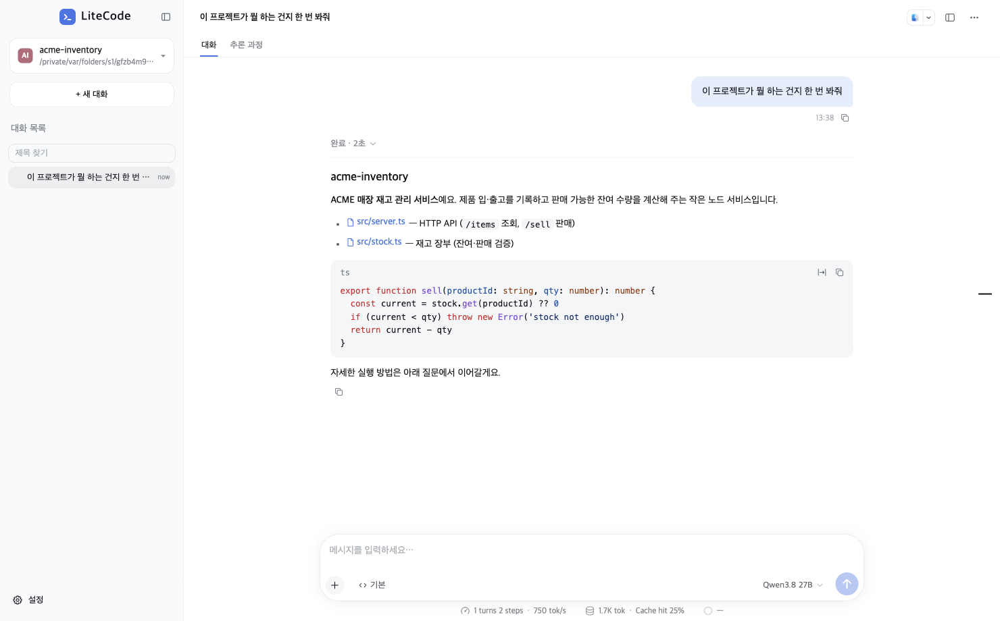
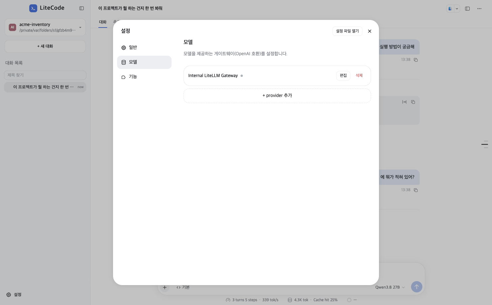
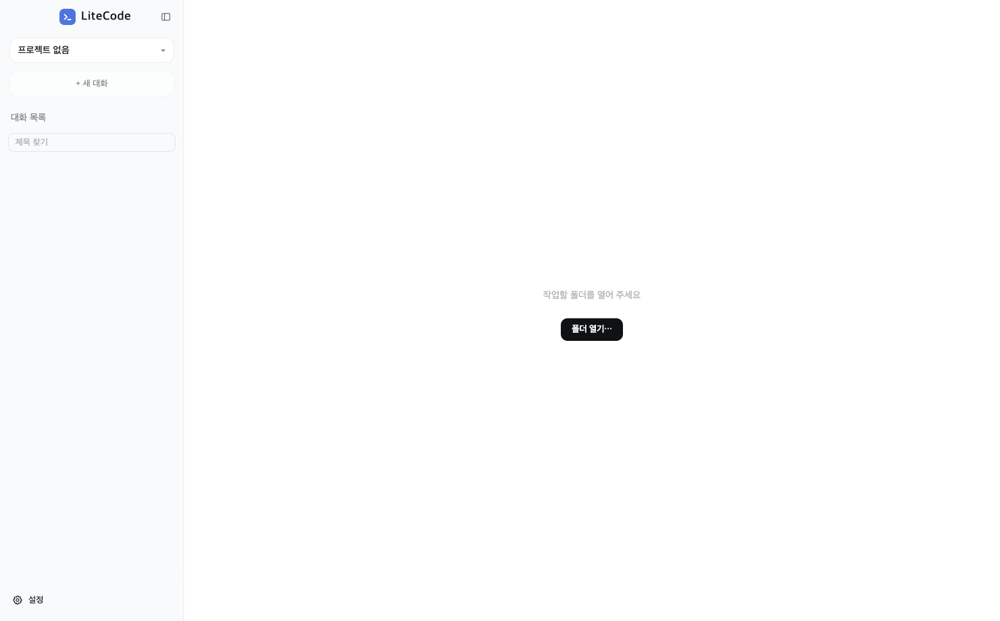
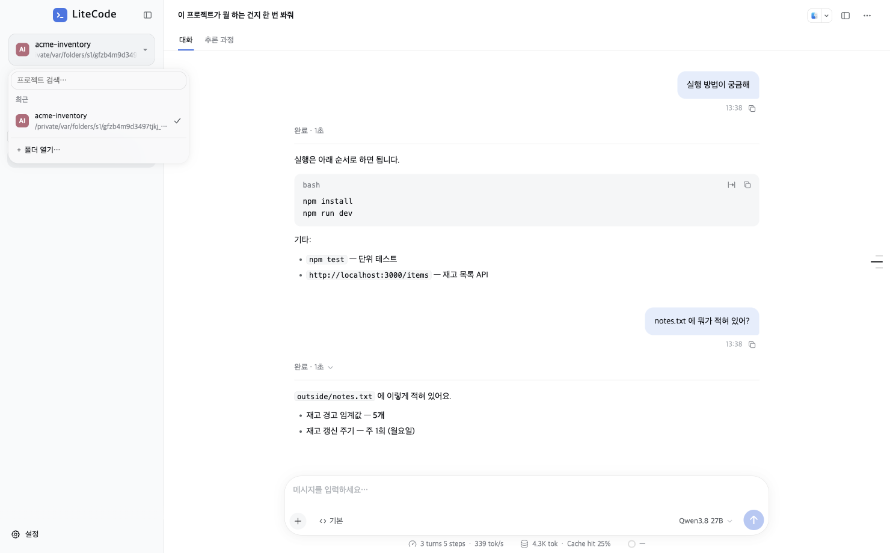
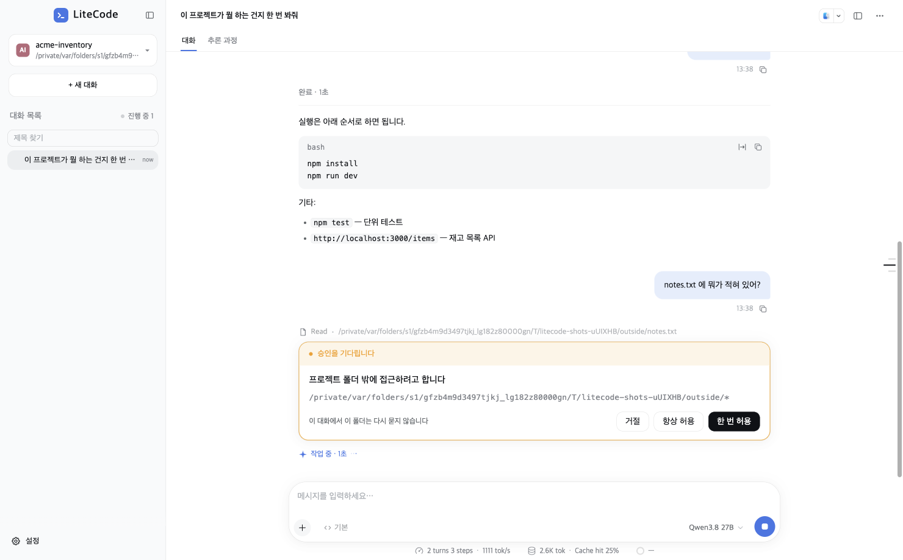

# LiteCode

폐쇄망 환경에서 쓰는 **원클릭 code assistant**. 설치본 하나면 끝이다 — 추가 프로그램 설치도,
런타임 다운로드도, 바깥 요청도 없다. 사내 LLM 게이트웨이 주소를 넣어 주면 **프로젝트 폴더에서
바로 대화하며 코드를 읽고 고치고 실행**한다.



- **데스크톱** — macOS (Apple Silicon / Intel), Windows
- **모바일** — [`mobile/`](mobile/) 의 Android 앱. 데스크톱에 붙어 쓰는 화면
- **폐쇄망 대응** — 런타임 내려받기 0, 외부 요청 0. 엔진(opencode)·검색(ripgrep)·음성 엔진까지
  설치본에 전부 동봉

## 사용법

### 1. 모델 설정하기 (한 번만)

좌하단 **설정 → 모델**. 사내 LLM 게이트웨이의 Base URL / API 키 / 모델 id 를 넣는다.
API 키는 암호화해서 저장되고 — 화면에도, 디스크에도 평문으로 남지 않는다.



기본 제공자 `Internal LiteLLM Gateway` 는 사내 LiteLLM 을 가리키므로, 보통은 **API 키만**
넣으면 된다. 새 게이트웨이가 필요하면 `+ provider 추가` 로 OpenAI 호환 주소를 얼마든 더할 수 있다.

### 2. 프로젝트 폴더 열기

처음 켜면 작업 폴더를 열어달라고 한다.



열었던 폴더들은 왼쪽 상단의 프로젝트 버튼에서 바로 전환한다 (검색·고정·이름 변경 지원).



### 3. 대화한다

Enter 로 보낸다. 어시스턴트는 프로젝트 폴더 안에서 bash · grep · 파일 읽기/쓰기 같은
**도구를 직접 실행**하며 답한다 — 폴더 밖을 건드리려 하면 승인 카드가 뜬다.



- `거절` · `한 번 허용` · `항상 허용`(이 대화에 한정)
- 답 위쪽의 "완료 · N초" 줄은 그 턴의 도구 실행 과정을 접어 둔 것
- 대화가 길어지면 **자동 요약**으로 컨텍스트를 줄여 이어간다
- 모델/게이트웨이 설정을 바꾸면 엔진이 재시작되고, 중간에 끊긴 턴은 "중단됨" 으로 표시돼
  같은 대화에서 이어서 보낼 수 있다

### 자주 쓰는 입력

| 입력 | 뜻 |
|---|---|
| `@` | 프로젝트 파일 붙이기 |
| `/` | 명령(스킬) 메뉴 |
| `!` | 셸 명령 카드 — 결과가 대화에 붙는다 |
| `+` | 첨부 · 스킬 · MCP · 훅 |
| 마이크 버튼 | 음성 채팅 — 말끝에 자동 전송, 답이 올 때까지 계속 경청 |

## 기능

- **채팅** — 마크다운·문법색, 진행 줄, 승인/질문 카드, 모드 칩, 할 일 줄, 고친 파일/결과물 카드
- **대화 관리** — 프로젝트별 세션, 자동 제목, 찾기, 고정, 대기열(전송 중에도 다른 대화에 보낼 수 있음)
- **오른쪽 패널** — 파일·폴더·HTML 미리보기
- **터미널** — 앱 안에서 셸 세션
- **트래젝터리** — 작업 흐름 기록
- **음성** — 음성 인식이 번들링돼 폐쇄망에서도 된다
- **모바일** — Android 앱이 데스크톱의 회화에 WS 로 붙는다 (단독 세션은 없음)
- **기능 묶음** — 설정 > 기능 에서 켜기/끄기. 꺼면 코드 통째로 내려간다
  (알림 · 원격 · 웹 가져오기 · 훅 · Chrome 조종 등)

## 아키텍처 (컨트리뷰터용)

```
Electron 렌더러 (React)           Electron 메인 프로세스
  사이드바(프로젝트·대화 목록)      ──IPC──▶  Cordis Context
  + 채팅 + 입력 카드                          ├─ ctx.engine    (opencode 띄우기·설정 생성)
                                              └─ ctx.llm       (opencode 를 감싼 대화 서비스)
                                                    │
                                                    ▼
                                              opencode 1.18.18 (외부 프로세스, REST+SSE)
                                                    │
                                                    ▼
                                              사내 LLM 게이트웨이
```

- 위층(화면·세션)은 opencode 를 모른다 — `ctx.llm` 이라는 서비스 키만 안다. 엔진 교체는
  `ctx.llm` + `ctx.engine` 경계만 바꾸면 된다.
- 에이전트 루프(툴 실행·프롬프트·컨텍스트 압축)는 opencode 의 것을 그대로 쓴다.
- **진짜 API 키는 opencode 에 주지 않는다.** 메인의 키 프록시가 요청에 붙여 준다.
- 플러그인 뼈대는 [Cordis](https://github.com/cordiverse/cordis) — `ctx.<key>` 로 서비스가
  등록되고, `inject` 로 의존성을 선언하면 뜨는 순서를 자동으로 맞춰 준다.

상세: [`docs/cordis-services.md`](docs/cordis-services.md) (서비스 목록·의존) ·
[`docs/opencode-protocol.md`](docs/opencode-protocol.md) (프로토콜 실측 기록) ·
[`docs/status.md`](docs/status.md) (조각별 상태)

## 개발

```bash
npm install
npm run dev        # vite + electron 개발 모드
npm run typecheck  # 타입 체크
npm test           # 단위 테스트 (vitest)
```

| 명령 | 설명 |
|---|---|
| `npm run test:live` | 실물 테스트 — 격리된 진짜 opencode + 가짜 LLM + 진짜 Electron 창 (opencode 가 PATH 에 있어야 함) |
| `npm run test:dist` | 설치본 스모크 — 빈 PATH·격리 HOME 으로 .app 을 띄워 대화 확인 |
| `npm run dist:mac` / `dist:win` | 설치본 빌드 — opencode·ripgrep·음성 엔진 받아 싣고 `release/` 에 만든다 |
| `npm run spike` | Electron 없이 서비스 골격만 돌려보는 최소 확인 |

**착지 기준**: `npm run typecheck` + `npm test` 초록.

디렉터리 구성: `renderer/` (React 화면) · `src/services/` (메인 프로세스 서비스) ·
`electron/` (메인 진입점·preload·호스트) · `shared/` (IPC 계약) · `scripts/` (dev·빌드)

## 참고 레포

| 레포 | 뭘 참고하나 |
|---|---|
| `closed-code/desktop` | 같은 opencode 를 다루던 기존 코드 — 실측 주석이 유용 |
| `deepseek-harness` (dsh) | Cordis 실사용 패턴, LLM provider 추상화, 화면 디자인 |
